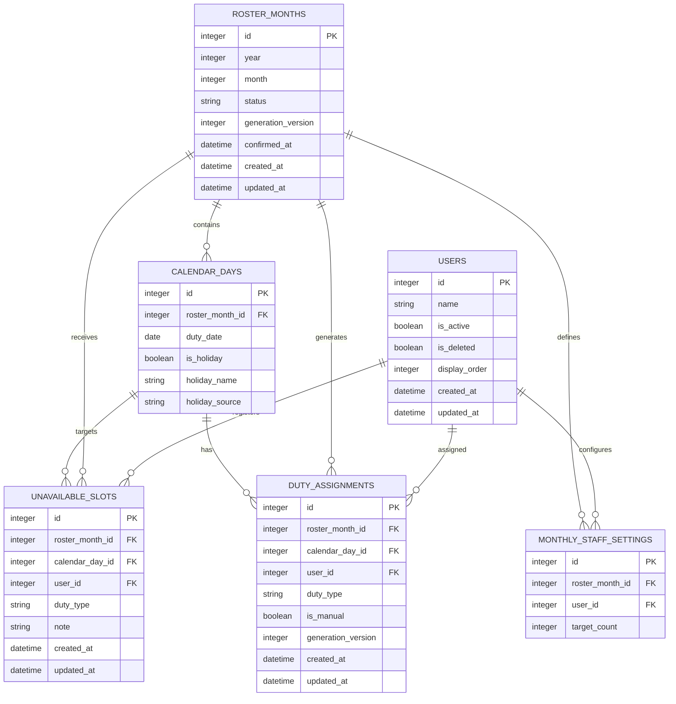

# 当直表作成アプリ

約10人のメンバーを対象に、月単位の当直表をブラウザ上で作成するPythonベースのWebアプリです。各メンバーが希望しない日時を登録し、その条件を考慮して当直表を自動生成します。

仕様に基づく初期版をDjangoで実装済みです。担当者管理、担当日の入力、希望しない日の入力、月間担当回数指定、公平性を考慮した自動生成、累積実績、手動調整、確定、PDF出力、PC・スマートフォン対応を含みます。

## 起動方法

### このプロジェクトですぐ起動する

PowerShellでプロジェクトフォルダを開き、次を実行します。

```powershell
.\start.ps1
```

ブラウザで `http://127.0.0.1:8000/` を開きます。

### 別のPCで初めて準備する

Python 3.12以降をインストールしたうえで、次を実行します。

```powershell
.\setup.ps1
.\start.ps1
```

### Ubuntu 24.04で最初から起動する

#### 1. Pythonと仮想環境を準備する

必要なパッケージをインストールします。

```bash
sudo apt update
sudo apt install -y python3 python3-venv python3-pip
```

プロジェクトのディレクトリへ移動します。`/path/to/当直表作成アプリ`は、実際の配置場所に置き換えてください。

```bash
cd /path/to/当直表作成アプリ
```

仮想環境を作成し、依存パッケージをインストールします。

```bash
python3 -m venv .venv
source .venv/bin/activate
python -m pip install --upgrade pip
python -m pip install -r requirements.txt
```

2回目以降は、プロジェクトへ移動して仮想環境を有効化するだけで準備できます。

```bash
cd /path/to/当直表作成アプリ
source .venv/bin/activate
```

#### 2. 環境変数を設定する

ローカルで試用する場合は、起動するターミナルで次を実行します。

```bash
export DJANGO_SECRET_KEY="$(python -c 'import secrets; print(secrets.token_urlsafe(50))')"
export DJANGO_DEBUG=true
export DJANGO_ALLOWED_HOSTS="127.0.0.1,localhost,0.0.0.0"
```

#### 3. DBを作成する

新しいSQLite DBとテーブルを作成します。

```bash
python manage.py migrate
```

既存のDBを初期化して作り直す場合は、先にバックアップしてからマイグレーションを実行します。

```bash
test ! -f db.sqlite3 || mv db.sqlite3 "db.sqlite3.backup-$(date +%Y%m%d-%H%M%S)"
python manage.py migrate
```

#### 4. `test`担当者を登録する

次のコマンドは、`test`担当者が存在しない場合だけ登録するため、繰り返し実行しても重複しません。

```bash
python manage.py shell -c "from roster.models import StaffMember; StaffMember.objects.get_or_create(name='test', defaults={'display_order': 1})"
```

登録内容を確認します。

```bash
python manage.py shell -c "from roster.models import StaffMember; print(list(StaffMember.objects.values('id', 'name', 'display_order', 'is_active')))"
```

#### 5. テストと起動

テストを実行します。

```bash
python manage.py test
```

Ubuntuマシン内からのみ利用する場合は、次のコマンドで起動します。

```bash
python manage.py runserver 127.0.0.1:8000
```

同じLAN内のPCやスマートフォンからも利用する場合は、すべてのネットワークインターフェースで待ち受けます。

```bash
python manage.py runserver 0.0.0.0:8000
```

UbuntuマシンのIPアドレスは次のコマンドで確認できます。

```bash
hostname -I
```

例えばIPアドレスが`192.168.1.50`の場合、別端末のブラウザで`http://192.168.1.50:8000/`を開きます。Ubuntuのファイアウォールが有効な場合は、必要に応じてポート8000を許可します。

```bash
sudo ufw allow 8000/tcp
```

`runserver`は開発・試用向けです。インターネットへ公開する場合は、GunicornやNginxなどを使用して本番環境を構成してください。

### スマートフォンからアクセスする

PCとスマートフォンを同じネットワークに接続し、PC側で `start.ps1` を実行します。スマートフォンのブラウザから `http://PCのIPアドレス:8000/` を開きます。WindowsファイアウォールでPythonの通信許可を求められた場合は、利用するプライベートネットワークに限って許可します。

### デモ担当者を登録する

必要な場合は、担当者10名をまとめて登録できます。

```powershell
.\.venv\Scripts\python.exe manage.py load_demo
```

### テスト

```powershell
.\.venv\Scripts\python.exe manage.py test
```

## 1. 想定する利用方法

1. 管理者が当直担当者を登録する
2. 作成対象の年月を選択する
3. 祝日と休日を確認・設定する
4. 各担当者が「希望しない日」を登録する
5. 管理者が「当直表生成」ボタンを押す
6. アプリが条件を満たす当直表を生成する
7. 管理者が結果を確認し、必要に応じて再生成または手動調整する
8. 当直表を確定する

## 2. 基本要件

### 対象期間と担当者

- 当直表は月単位で作成する
- 1か月あたり約10人の担当者を想定する
- 担当者の追加、編集、無効化ができる
- 過去の当直表から担当者を削除しないため、担当を外れた人は物理削除せず無効化する

### 当直枠

当直枠は次の2種類とします。

| 種類 | 用途 | 平日 | 休日・祝日 |
|---|---|---:|---:|
| 日直 | 日中の当直 | なし | 1人 |
| 夜間当直 | 夜間の当直 | 1人 | 1人 |

- 平日は、1日につき夜間当直1人を割り当てる
- 休日・祝日は、日直1人と夜間当直1人をそれぞれ割り当てる
- 同じ日の日直と夜間当直は、原則として別の人を割り当てる
- 休日には土曜日・日曜日を含める
- 日本の祝日は祝日データから自動判定し、管理者が個別に休日扱いを変更できる設計とする

### 希望しない日の登録

- 各担当者は月ごとに希望しない日を入力できる
- 各担当者はその月の担当回数を任意で指定できる
- カレンダーは月曜始まりとし、土曜日・日曜日を右端に配置する
- 平日は夜間当直について希望しない日を登録できる
- 休日・祝日は日直と夜間当直を別々に登録できる
- 休日・祝日の両方の枠を希望しない場合は、日直と夜間当直の両方を選択する
- 登録期限後の変更可否は、将来の管理設定として検討する

### 当直表生成

- 「当直表生成」ボタンで対象月の当直表を生成する
- 希望しない日時には割り当てない
- 1つの当直枠には必ず1人だけを割り当てる
- 同じ担当者に割り当てが偏らないよう、担当回数をできるだけ均等にする
- 日直と夜間当直の回数は別々に集計し、それぞれの偏りを抑える
- 休日・祝日の担当回数（日直と夜間当直の合計）は、全担当者で均等にする
- 休日・祝日の当直枠数が担当者数で割り切れない場合は、担当回数の最大差を1回以内とする
- 生成できない場合は、不足している当直枠と原因候補を表示する
- 再生成時は、未確定の結果を置き換える
- 確定済みの当直表を再生成する場合は、確認を求める

## 3. 生成ルール案

### 必須条件

必ず守る条件です。

1. 各当直枠に1人を割り当てる
2. 無効な担当者を割り当てない
3. 担当者が希望しない当直枠には割り当てない
4. 同じ日時・同じ当直種別に複数人を割り当てない
5. 同じ日の「日直」と「夜間当直」に同じ人を割り当てない
6. 休日・祝日の日直と夜間当直を合算した担当回数について、最多の人と最少の人の差を1回以内にする

希望しない日の条件によって休日担当回数の最大差を1回以内にできない場合は、不公平な結果を自動確定せず、生成不能として対象者・対象枠を表示します。

### 最適化したい条件

完全には守れない場合でも、できるだけ満たす条件です。

1. 全担当者の総担当回数を均等にする
2. 日直回数を均等にする
3. 夜間当直回数を均等にする
4. 同じ担当者の連続勤務を避ける
5. 当直間隔が短くなりすぎないようにする

生成処理には、制約充足問題を扱いやすい最適化ライブラリの利用を検討します。小規模構成では単純な候補選択でも動作しますが、公平性と「生成不能理由」の説明を考慮すると、Google OR-Toolsなどの制約ソルバーが適しています。

## 4. 画面構成案

### 当直表画面

- 対象年月の選択
- 当直表生成ボタン
- 再生成ボタン
- 確定ボタン
- 日付、曜日、休日区分、日直担当者、夜間当直担当者の一覧
- 担当者ごとの日直回数、夜間当直回数、休日担当回数の集計
- 未割当や条件違反の警告表示

### 希望しない日入力画面

- 対象年月の選択
- 担当者の選択
- カレンダー形式での日付選択
- 平日は夜間当直の可否を入力
- 休日・祝日は日直と夜間当直を個別に入力
- 一括保存

### 担当者管理画面

- 担当者一覧
- 担当者の追加・編集
- 表示順の変更
- 有効・無効の切り替え

### 担当日設定画面

- 月間カレンダーで日直・夜間当直の有無を設定
- 土日・祝日の自動表示
- 割り当てなしの枠を当直表でハイフン表示

## 5. PC・スマートフォン対応

レスポンシブWebデザインとし、同じURLをPCとスマートフォンの両方で利用できるようにします。

### PC表示

- 当直表を横長の表として一覧表示する
- 日直、夜間当直、集計を同時に確認できるようにする
- マウス操作で担当者を変更できるUIを検討する

### スマートフォン表示

- 当直表は日付ごとのカード、または横スクロール可能な表として表示する
- 主要ボタンをタップしやすい大きさにする
- 希望しない日はカレンダー上で日付を選び、日直・夜間当直を切り替えられるようにする
- 入力項目を1列に配置し、画面幅に応じてレイアウトを変更する
- 生成・保存などの重要操作では確認メッセージを表示する

## 6. 技術構成案

初期開発では、管理画面、認証、フォーム、ORM、DBマイグレーションを一体で扱えるDjangoを採用候補とします。約10人規模の業務アプリでは、バックエンドとフロントエンドを別プロジェクトに分けず、DjangoがHTMLを生成する構成が実装・運用ともに簡潔です。

| 区分 | 候補 |
|---|---|
| Webフレームワーク | Python / Django（安定版またはLTS版） |
| ORM | Django ORM |
| DBマイグレーション | Django migrations |
| データベース | SQLite（初期開発）、PostgreSQL（複数端末・本番運用） |
| HTML生成 | Django Templates |
| フロントエンド | HTML / CSS / 少量のJavaScript |
| UI | Bootstrap |
| 当直表生成 | Google OR-Tools |
| 祝日判定 | `jpholiday` または祝日マスタ |
| テスト | pytest |

初期版はDjango Templatesでサーバー側HTMLを生成し、希望日選択や部分更新など必要な箇所だけJavaScriptで操作性を補います。担当者や休日マスタなどの内部管理にはDjango管理画面を利用し、日々使う当直表・希望入力画面は専用画面として作成します。Reactなどを使ったSPAは、初期要件に対して構成と保守対象が増えるため採用しません。

## 7. DB設計案

### ER図



### `users`：担当者

| カラム | 型 | 制約・用途 |
|---|---|---|
| `id` | INTEGER | 主キー |
| `name` | VARCHAR(100) | 必須、表示名 |
| `is_active` | BOOLEAN | 必須、初期値 `true` |
| `is_deleted` | BOOLEAN | 画面上で削除済みか。過去実績は保持 |
| `display_order` | INTEGER | 一覧での表示順 |
| `created_at` | DATETIME | 作成日時 |
| `updated_at` | DATETIME | 更新日時 |

担当履歴と累積実績を維持するため、画面上で削除した場合もレコードは残し、`is_active = false`、`is_deleted = true` にします。

### `roster_months`：月別当直表

| カラム | 型 | 制約・用途 |
|---|---|---|
| `id` | INTEGER | 主キー |
| `year` | INTEGER | 必須 |
| `month` | INTEGER | 必須、1～12 |
| `status` | VARCHAR(20) | `draft`、`generated`、`confirmed` |
| `generation_version` | INTEGER | 再生成回数、初期値0 |
| `confirmed_at` | DATETIME | 確定日時、未確定時はNULL |
| `created_at` | DATETIME | 作成日時 |
| `updated_at` | DATETIME | 更新日時 |

`year` と `month` の組み合わせには一意制約を設定します。

### `calendar_days`：対象月の日付

| カラム | 型 | 制約・用途 |
|---|---|---|
| `id` | INTEGER | 主キー |
| `roster_month_id` | INTEGER | `roster_months.id` への外部キー |
| `duty_date` | DATE | 必須 |
| `is_holiday` | BOOLEAN | 土日、祝日、独自休日の場合 `true` |
| `holiday_name` | VARCHAR(100) | 祝日名や独自休日名、平日はNULL |
| `holiday_source` | VARCHAR(20) | `weekend`、`national`、`custom`、`override` |

`roster_month_id` と `duty_date` の組み合わせには一意制約を設定します。休日情報を月ごとのスナップショットとして保持することで、祝日設定が後から変わっても過去の当直表を再現できます。

### `monthly_staff_settings`：月間担当回数

| カラム | 型 | 制約・用途 |
|---|---|---|
| `id` | INTEGER | 主キー |
| `roster_month_id` | INTEGER | `roster_months.id` への外部キー |
| `user_id` | INTEGER | `users.id` への外部キー |
| `target_count` | INTEGER | 任意指定するその月の担当回数 |

指定した担当者については、日直と夜間当直の合計が `target_count` と一致することを生成時の必須条件にします。

### `unavailable_slots`：希望しない当直枠

| カラム | 型 | 制約・用途 |
|---|---|---|
| `id` | INTEGER | 主キー |
| `roster_month_id` | INTEGER | `roster_months.id` への外部キー |
| `calendar_day_id` | INTEGER | `calendar_days.id` への外部キー |
| `user_id` | INTEGER | `users.id` への外部キー |
| `duty_type` | VARCHAR(20) | `day` または `night` |
| `note` | VARCHAR(255) | 任意の理由・備考 |
| `created_at` | DATETIME | 作成日時 |
| `updated_at` | DATETIME | 更新日時 |

`calendar_day_id`、`user_id`、`duty_type` の組み合わせには一意制約を設定します。平日に `day` を登録できないよう、アプリケーション側でも入力を検証します。

### `duty_assignments`：生成された割り当て

| カラム | 型 | 制約・用途 |
|---|---|---|
| `id` | INTEGER | 主キー |
| `roster_month_id` | INTEGER | `roster_months.id` への外部キー |
| `calendar_day_id` | INTEGER | `calendar_days.id` への外部キー |
| `user_id` | INTEGER | `users.id` への外部キー |
| `duty_type` | VARCHAR(20) | `day` または `night` |
| `is_manual` | BOOLEAN | 手動調整された場合 `true` |
| `generation_version` | INTEGER | どの生成結果かを識別 |
| `created_at` | DATETIME | 作成日時 |
| `updated_at` | DATETIME | 更新日時 |

`calendar_day_id` と `duty_type` の組み合わせには一意制約を設定し、1つの当直枠に複数人が割り当てられないようにします。

### 将来追加を検討するテーブル

- `assignment_rules`：連続勤務禁止日数などの生成ルール
- `accounts`：ログイン情報と権限
- `audit_logs`：生成、確定、手動変更の操作履歴
- `roster_snapshots`：確定版・過去バージョンの完全保存

## 8. 主なAPI案

サーバー側HTML生成を基本とする場合でも、生成や保存処理は次の単位に分けます。

| メソッド | パス | 用途 |
|---|---|---|
| `GET` | `/rosters/{year}/{month}` | 月別当直表の表示 |
| `POST` | `/rosters/{year}/{month}/generate` | 当直表の生成・再生成 |
| `POST` | `/rosters/{year}/{month}/confirm` | 当直表の確定 |
| `GET` | `/rosters/{year}/{month}/pdf` | 確定済み当直表のPDF出力 |
| `GET` | `/availability/{year}/{month}` | 希望しない日の入力画面 |
| `POST` | `/availability/{year}/{month}` | 希望しない日の一括保存 |
| `GET` | `/users` | 担当者一覧 |
| `POST` | `/users` | 担当者追加 |
| `POST` | `/users/{user_id}` | 担当者更新 |
| `GET` | `/rosters/{id}/duty-days/` | 担当日設定画面 |
| `POST` | `/rosters/{id}/duty-days/` | 担当日設定の保存 |

## 9. 入力チェックとエラー表示

- 対象月に有効な担当者がいない場合は生成しない
- 希望しない人しかいない当直枠がある場合は、生成前に警告する
- 生成に失敗した場合は「割り当てできませんでした」だけでなく、対象日と当直種別を表示する
- 確定済み当直表への変更は確認を求める
- 二重送信による重複生成・重複保存を防止する
- DB更新はトランザクション内で実行し、途中失敗時は元の状態を維持する

## 10. セキュリティと運用

- 初期版を院内・組織内ネットワークだけで使う場合も、管理画面への認証導入を検討する
- インターネット公開する場合はログイン、権限管理、HTTPS、CSRF対策を必須とする
- 担当者には自身の希望入力のみ、管理者には全体設定と生成・確定を許可する構成を検討する
- 希望しない日の情報を個人情報として扱い、必要以上の理由を記録しない
- DBの定期バックアップと、確定済み当直表の保存を行う

## 11. 仕様決定が必要な項目

実装前に、特に次の点を決定する必要があります。

1. 平日の割り当ては夜間当直だけでよいか
2. 土曜日を終日休日として扱うか
3. 同じ人が同じ日の日直と夜間当直を兼務できる例外があるか
4. 連続勤務を何日間隔で禁止または抑制するか
5. 月間担当回数以外に、個人別の上限・下限や重みを設定するか
6. 前月末・翌月初の割り当てを連続勤務判定に含めるか
7. 生成後の担当者変更を手動で許可するか
8. 希望しない日の入力を本人が行うか、管理者がまとめて行うか
9. ログイン機能を初期版から導入するか
10. PDFに加えてExcel出力や印刷専用画面を用意するか

## 12. 初期リリースの範囲案

最初のリリースでは、次の機能に絞ります。

- 担当者管理
- 月と休日の設定
- 希望しない日の登録
- 必須条件と基本的な公平性を考慮した自動生成
- PC・スマートフォン対応の当直表表示
- 生成結果の確認と再生成
- 担当者別の累積実績
- 確定表のPDF出力
- SQLiteによるデータ保存

認証、複雑な個別ルール、Excel出力、詳細な操作履歴は、基本機能の運用確認後に追加します。

## ライセンス

未定です。

